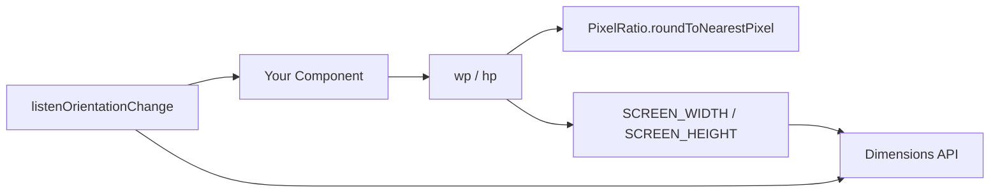

<p align="center">
  
</p>

<h1 align="center">medhira-react-native-responsive-screen</h1>

<p align="center">
  <strong>Responsive screen utilities for React Native — percentage to dp, orientation-aware layouts, zero runtime dependencies.</strong>
</p>

<p align="center">
  <a href="https://www.npmjs.com/package/medhira-react-native-responsive-screen"></a>
  <a href="https://www.npmjs.com/package/medhira-react-native-responsive-screen"></a>
  <a href="https://medhira-react-native-responsive-screen.readthedocs.io"></a>
</p>

<p align="center">
  <a href="#features">Features</a> •
  <a href="#installation">Installation</a> •
  <a href="#quick-start">Quick Start</a> •
  <a href="#api">API</a> •
  <a href="#orientation-changes">Orientation</a> •
  <a href="#contributing">Contributing</a>
</p>

---

## Features

| | |
|---|---|
| 📐 **Responsive sizing** | Convert `%` values to device-independent pixels with `wp()` and `hp()` |
| 🔄 **Orientation support** | Listen for rotation and re-render layouts automatically |
| ⚛️ **Modern React** | Built-in `useResponsiveScreen()` hook for functional components |
| 🪶 **Zero dependencies** | Only peer deps on `react` and `react-native` |
| 🛡️ **TypeScript** | Full type definitions included |

## Installation

```bash
# Expo
npx expo install medhira-react-native-responsive-screen

# React Native CLI
npm install medhira-react-native-responsive-screen
```

## Quick Start

```tsx
import { StyleSheet, View, Text } from 'react-native';
import {
  widthPercentageToDP as wp,
  heightPercentageToDP as hp,
} from 'medhira-react-native-responsive-screen';

const styles = StyleSheet.create({
  container: {
    width: wp('80%'),
    height: hp('70%'),
  },
  title: {
    fontSize: hp('3%'),
  },
});

export default function App() {
  return (
    <View style={styles.container}>
      <Text style={styles.title}>Hello, responsive world!</Text>
    </View>
  );
}
```

## API

### Core functions

| Export | Alias | Description |
|--------|-------|-------------|
| `widthPercentageToDP` | `wp` | Convert width % → dp |
| `heightPercentageToDP` | `hp` | Convert height % → dp |
| `getScreenWidth()` | — | Current screen width in dp |
| `getScreenHeight()` | — | Current screen height in dp |
| `listenOrientationChange` | — | Register orientation listener |
| `removeOrientationListener` | — | Remove orientation listener |
| `useResponsiveScreen` | — | React hook for responsive layouts |

### Constants

| Export | Description |
|--------|-------------|
| `SCREEN_WIDTH` | Live screen width (updates on orientation change) |
| `SCREEN_HEIGHT` | Live screen height (updates on orientation change) |

> **Tip:** Use `wp()` for horizontal sizing (width, padding, margins) and `hp()` for vertical sizing (height, font size).

## Orientation Changes

When the device rotates, recreate styles inside `render` or use the hook so values are recalculated.

### Functional component (recommended)

```tsx
import { StyleSheet, View, Text } from 'react-native';
import { useResponsiveScreen } from 'medhira-react-native-responsive-screen';

export default function ResponsiveScreen() {
  const { wp, hp, orientation } = useResponsiveScreen();

  const styles = StyleSheet.create({
    box: {
      width: wp('80%'),
      height: hp('50%'),
    },
  });

  return (
    <View style={styles.box}>
      <Text>Orientation: {orientation}</Text>
    </View>
  );
}
```

### Class component

```tsx
import { Component } from 'react';
import { StyleSheet, View } from 'react-native';
import {
  widthPercentageToDP as wp,
  heightPercentageToDP as hp,
  listenOrientationChange,
  removeOrientationListener,
} from 'medhira-react-native-responsive-screen';

export default class ResponsiveScreen extends Component {
  componentDidMount() {
    listenOrientationChange(this);
  }

  componentWillUnmount() {
    removeOrientationListener();
  }

  render() {
    const styles = StyleSheet.create({
      box: { width: wp('80%'), height: hp('50%') },
    });

    return <View style={styles.box} />;
  }
}
```

## Architecture



## Documentation

Full docs: **[medhira-react-native-responsive-screen.readthedocs.io](https://medhira-react-native-responsive-screen.readthedocs.io)**

## Contributing

Contributions are welcome! Please open an issue or pull request on GitHub.

1. Fork the repository
2. Create a feature branch
3. Run `npm test`, `npm run lint`, and `npm run typecheck`
4. Submit a pull request

## Support

- **GitHub:** [HELLOMEDHIRA/medhira-react-native-responsive-screen](https://github.com/HELLOMEDHIRA/medhira-react-native-responsive-screen)
- **Email:** hello.medhira@gmail.com
- **Docs:** [medhira.readthedocs.io](https://medhira.readthedocs.io/en/latest/)

---

<p align="center">
  <strong>MEDHIRA</strong> — Engineering Intelligence Across Everything
</p>

<p align="center">
  Made with passion by <a href="https://github.com/HELLOMEDHIRA">MEDHIRA</a>
</p>

## License

[Apache License 2.0](LICENSE)
