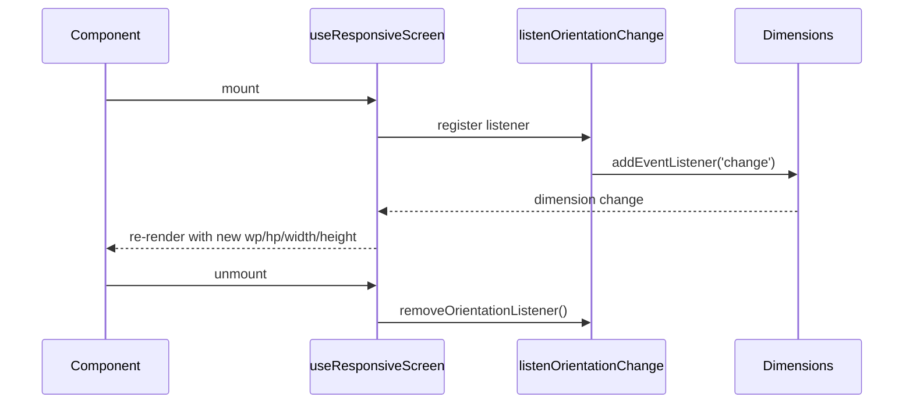

# Hooks

## `useResponsiveScreen()`

A React hook that provides responsive helpers and live dimension updates on orientation change.

```tsx
import { StyleSheet, View, Text } from 'react-native';
import { useResponsiveScreen } from 'medhira-react-native-responsive-screen';

export default function Dashboard() {
  const { wp, hp, width, height, orientation } = useResponsiveScreen();

  const styles = StyleSheet.create({
    panel: {
      width: wp('90%'),
      height: hp('30%'),
    },
  });

  return (
    <View style={styles.panel}>
      <Text>
        {width}×{height} — {orientation}
      </Text>
    </View>
  );
}
```

## Return value

| Property | Type | Description |
|----------|------|-------------|
| `wp` | `(value: string \| number) => number` | Width percentage converter |
| `hp` | `(value: string \| number) => number` | Height percentage converter |
| `width` | `number` | Current screen width in dp |
| `height` | `number` | Current screen height in dp |
| `orientation` | `'portrait' \| 'landscape'` | Current orientation |

## Lifecycle



!!! note
    Define `StyleSheet.create()` inside the component body so styles recalculate when dimensions change.
