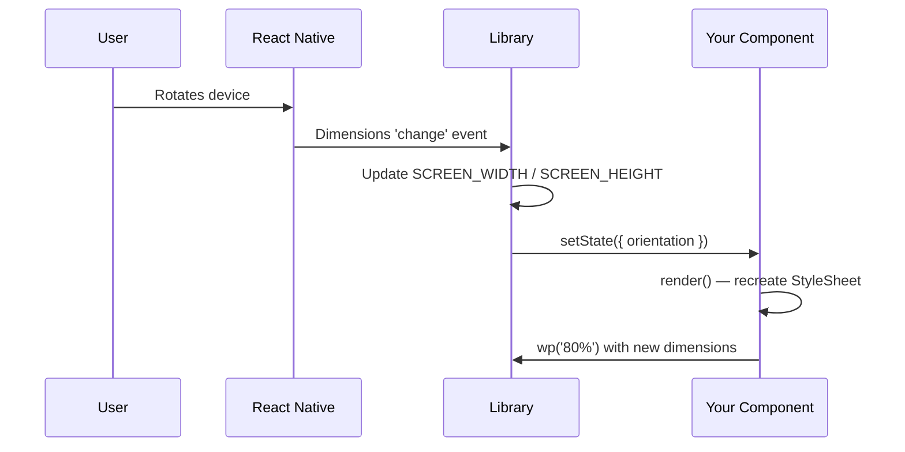

# Orientation Changes

When the device rotates, screen width and height swap. Static styles created outside `render` will **not** update automatically.

## The golden rule

> **Recreate styles after every orientation change** — inside `render`, or inside a component that re-renders when dimensions change.

## Recommended: `useResponsiveScreen` hook

```tsx
import { StyleSheet, View } from 'react-native';
import { useResponsiveScreen } from 'medhira-react-native-responsive-screen';

export default function Screen() {
  const { wp, hp } = useResponsiveScreen();

  const styles = StyleSheet.create({
    box: { width: wp('80%'), height: hp('50%') },
  });

  return <View style={styles.box} />;
}
```

The hook automatically registers and cleans up the dimension listener.

## Class component pattern

```tsx
import { Component } from 'react';
import { StyleSheet, View } from 'react-native';
import {
  widthPercentageToDP as wp,
  heightPercentageToDP as hp,
  listenOrientationChange,
  removeOrientationListener,
} from 'medhira-react-native-responsive-screen';

export default class Screen extends Component {
  componentDidMount() {
    listenOrientationChange(this);
  }

  componentWillUnmount() {
    removeOrientationListener();
  }

  render() {
    const styles = StyleSheet.create({
      box: { width: wp('80%'), height: hp('50%') },
    });

    return <View style={styles.box} />;
  }
}
```

## Flow diagram



## Common mistakes

| Mistake | Fix |
|---------|-----|
| Styles defined outside the component | Move `StyleSheet.create()` inside `render` or the component body |
| Forgetting `removeOrientationListener` | Always clean up in `componentWillUnmount` or use the hook |
| Using `wp` for font size on tablets | Consider `hp` or a max constraint for readability |
