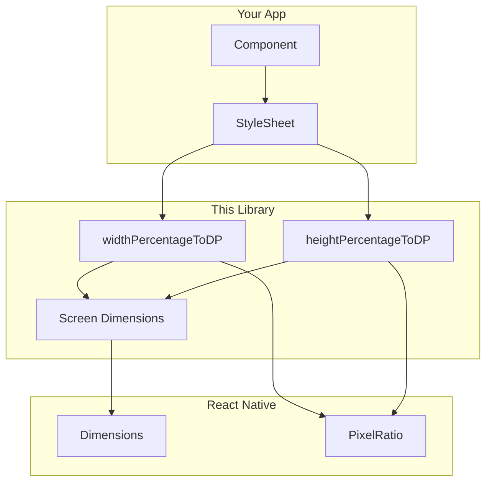

<p align="center">
  
</p>

<p align="center">
  <strong>Engineering Intelligence Across Everything</strong>
</p>

---

**medhira-react-native-responsive-screen** provides simple, reliable utilities to build responsive React Native layouts across phones and tablets.

## Why use this library?

- Convert percentage strings like `'80%'` into device-independent pixels
- Handle orientation changes without manual dimension math
- Works with Expo and React Native CLI
- Zero runtime dependencies — lightweight and predictable

## Quick example

```tsx
import { StyleSheet, View } from 'react-native';
import {
  widthPercentageToDP as wp,
  heightPercentageToDP as hp,
} from 'medhira-react-native-responsive-screen';

const styles = StyleSheet.create({
  card: {
    width: wp('90%'),
    height: hp('25%'),
  },
});
```

## How it works



## Next steps

- [Installation](getting-started/installation.md)
- [Quick Start](getting-started/quick-start.md)
- [API Reference](api/functions.md)
- [Orientation Guide](guides/orientation.md)

## Contact

- **Email:** hello.medhira@gmail.com
- **GitHub:** [HELLOMEDHIRA](https://github.com/HELLOMEDHIRA)

---

**MEDHIRA** — Engineering Intelligence Across Everything
